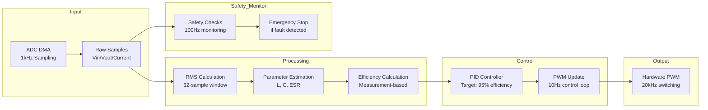
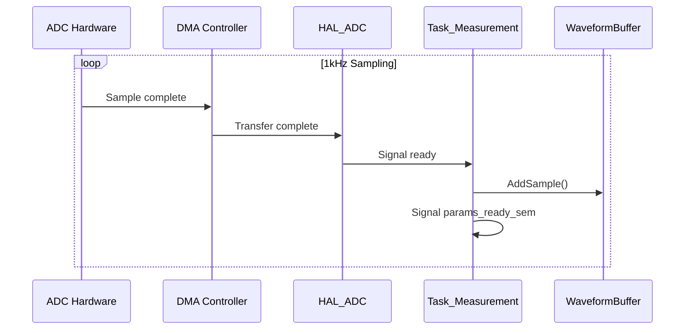
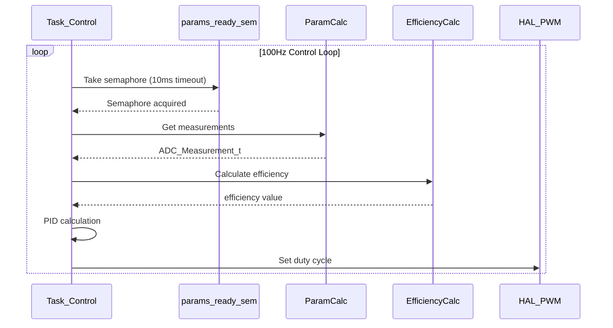
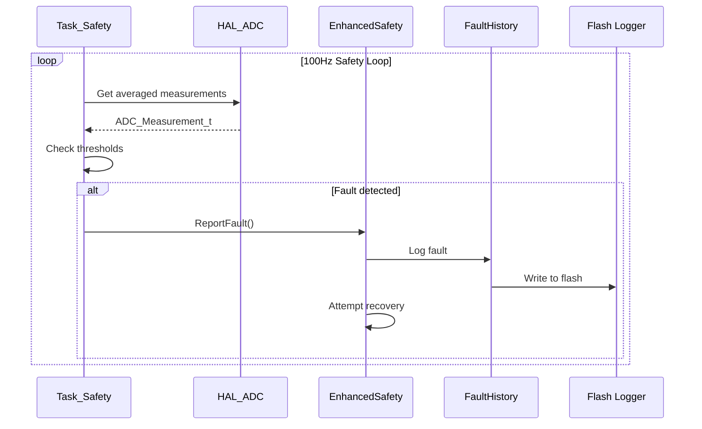
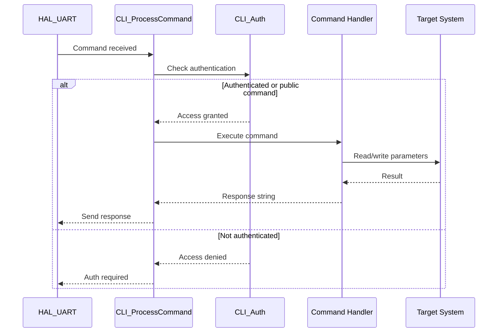
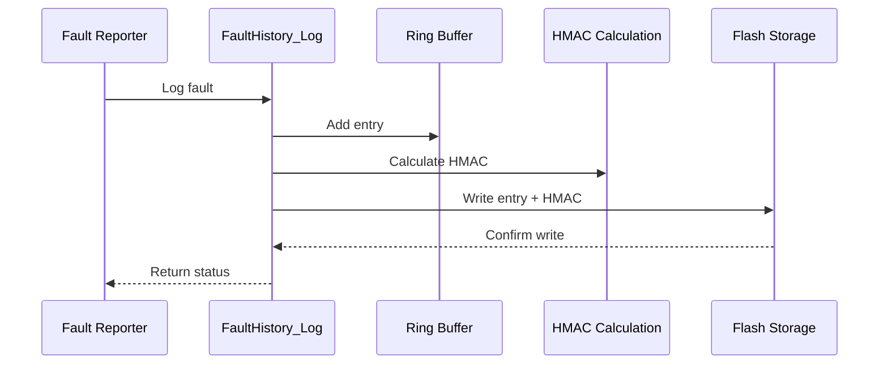
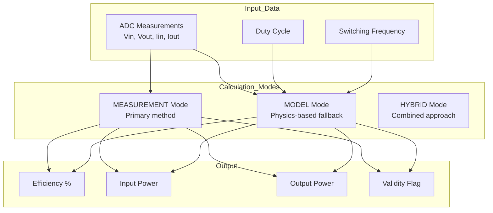
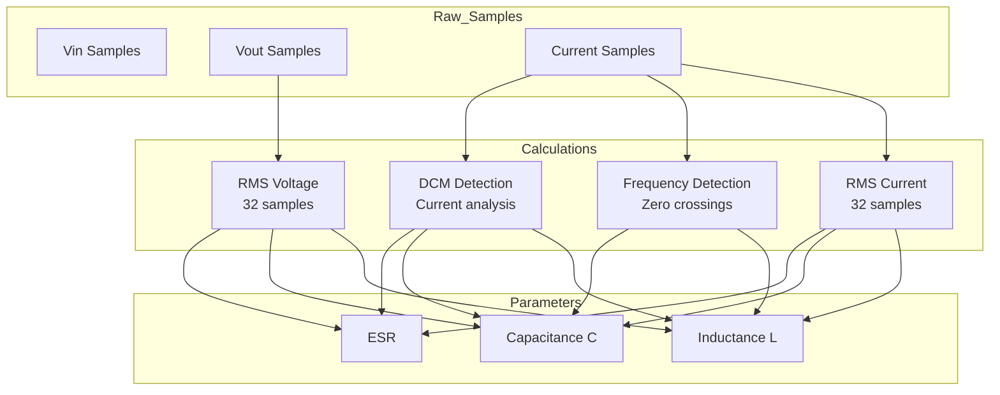
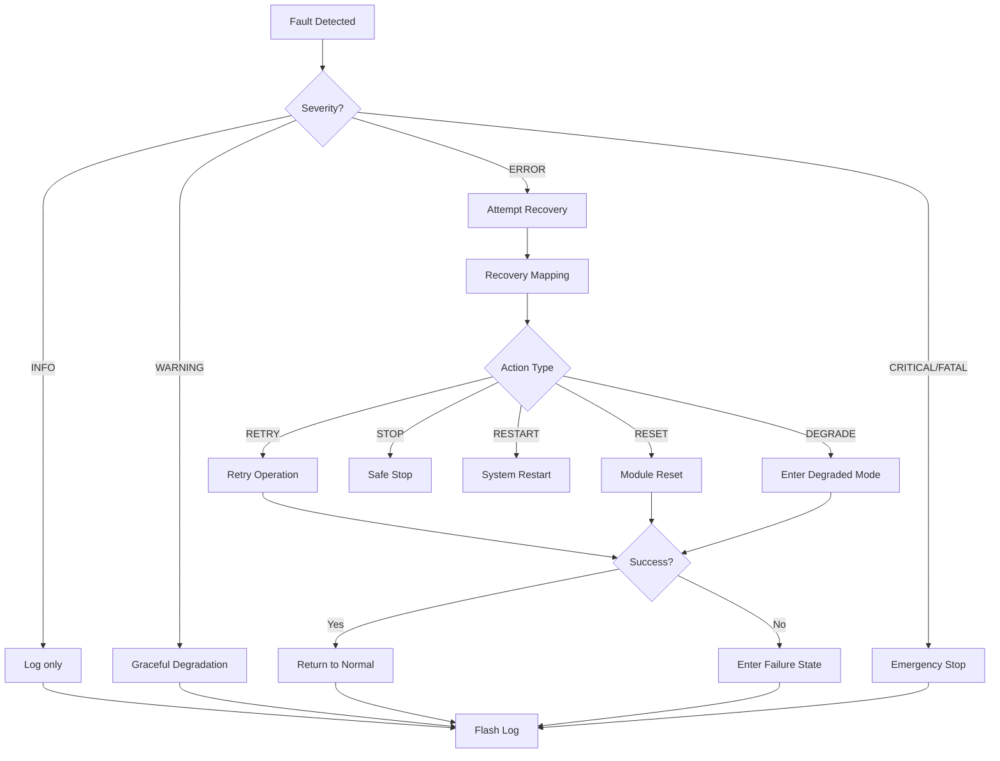

# Data Flow Documentation

## Overview

This document describes the data flow through the AdaptivePWM system.

## System Data Flow

## ADC Data Flow

## Control Loop Data Flow

## Safety System Data Flow

## CLI Data Flow

## Fault History Data Flow

## Efficiency Calculation Data Flow

## Parameter Estimation Data Flow

## Recovery Data Flow

