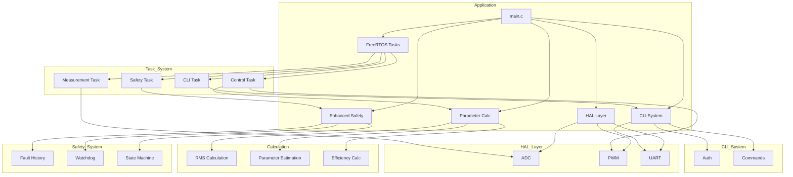
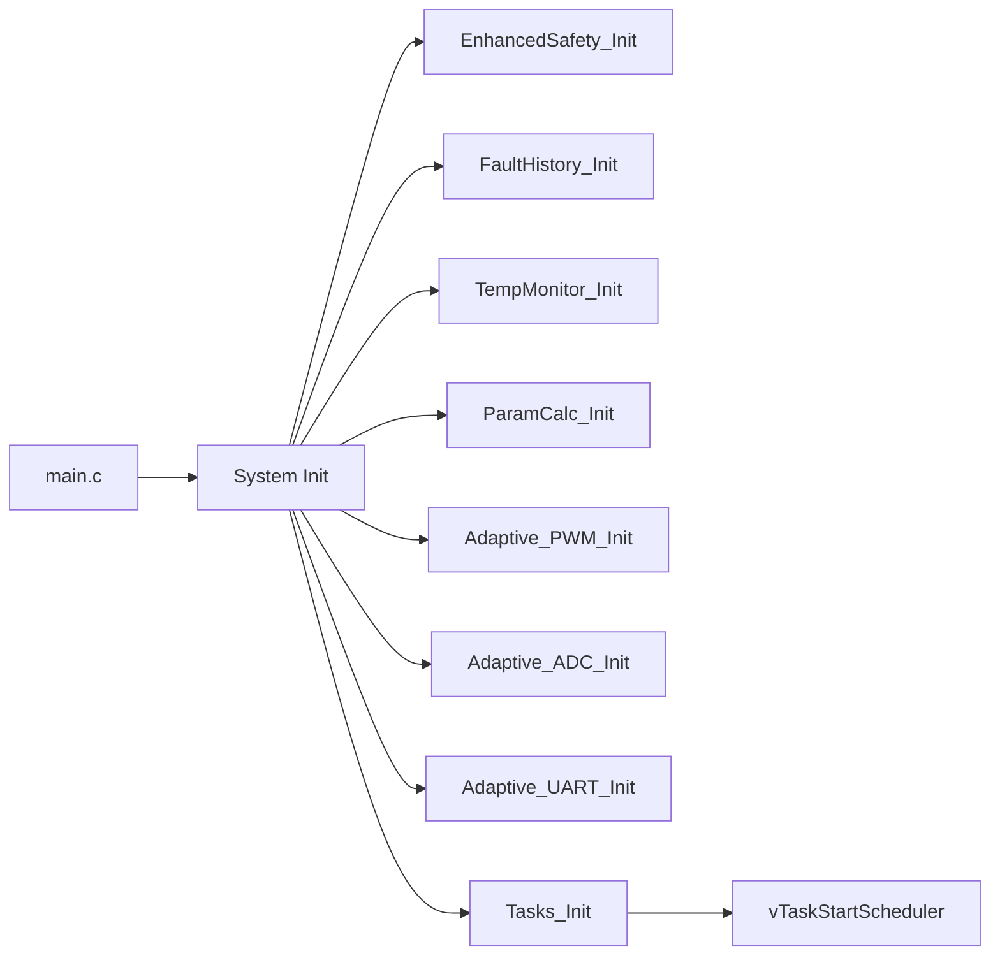
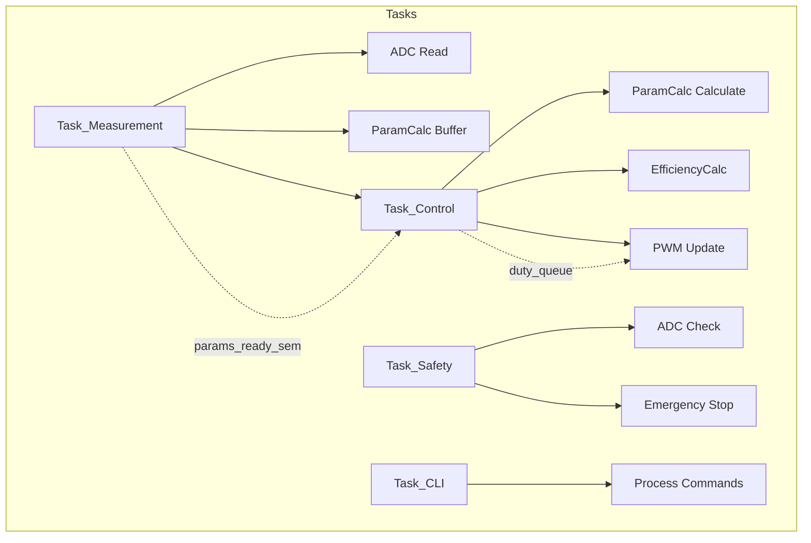
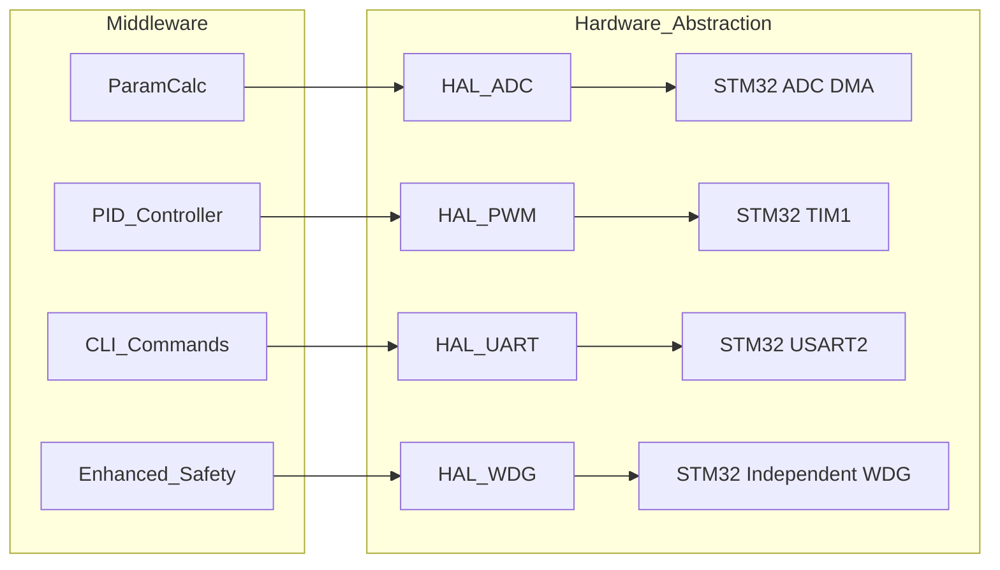
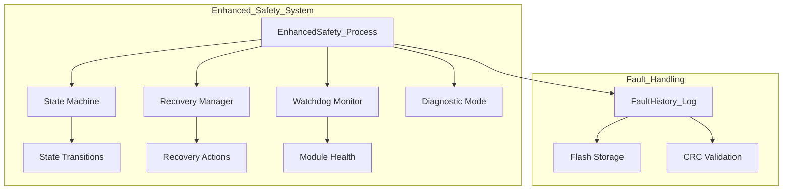
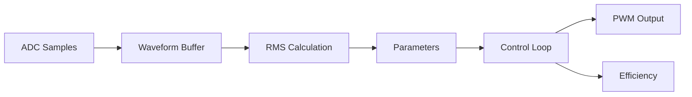
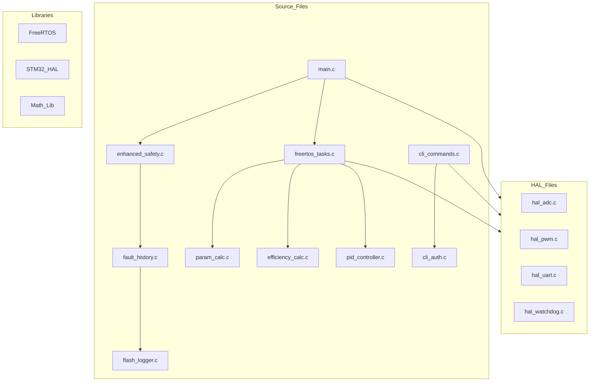

# Module Dependency Diagrams

## Overview

This document describes the module dependencies in the AdaptivePWM system.

## High-Level Architecture

## Core Module Dependencies

### Main Application Flow

### Task Dependencies

## HAL Layer Dependencies

## Safety System Dependencies

## Data Flow

## Build Dependencies

