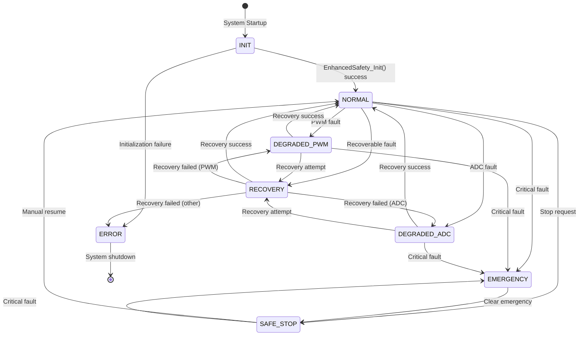
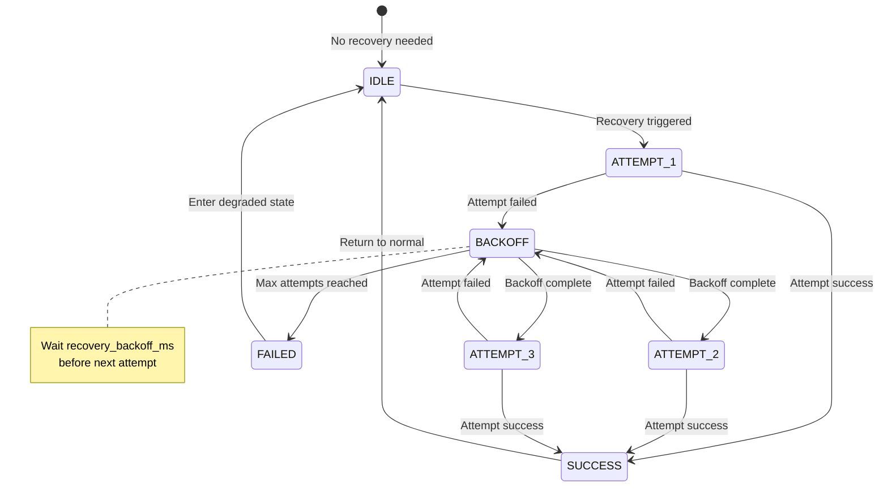
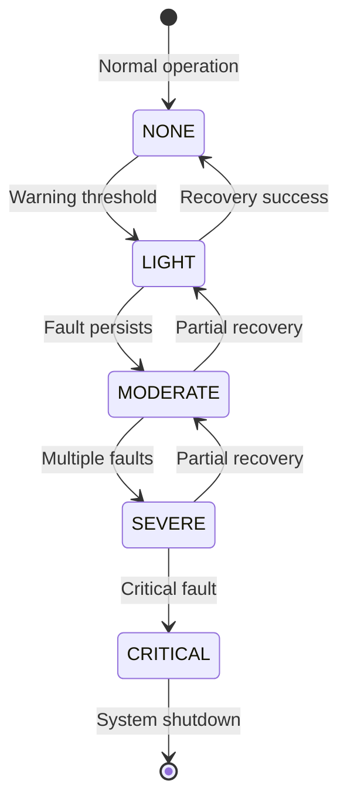
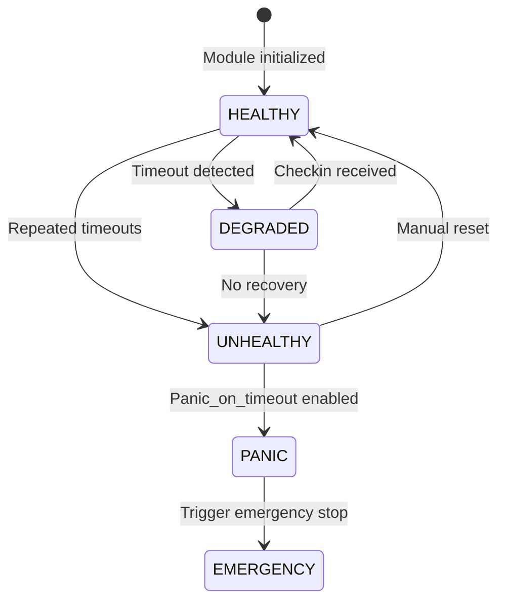
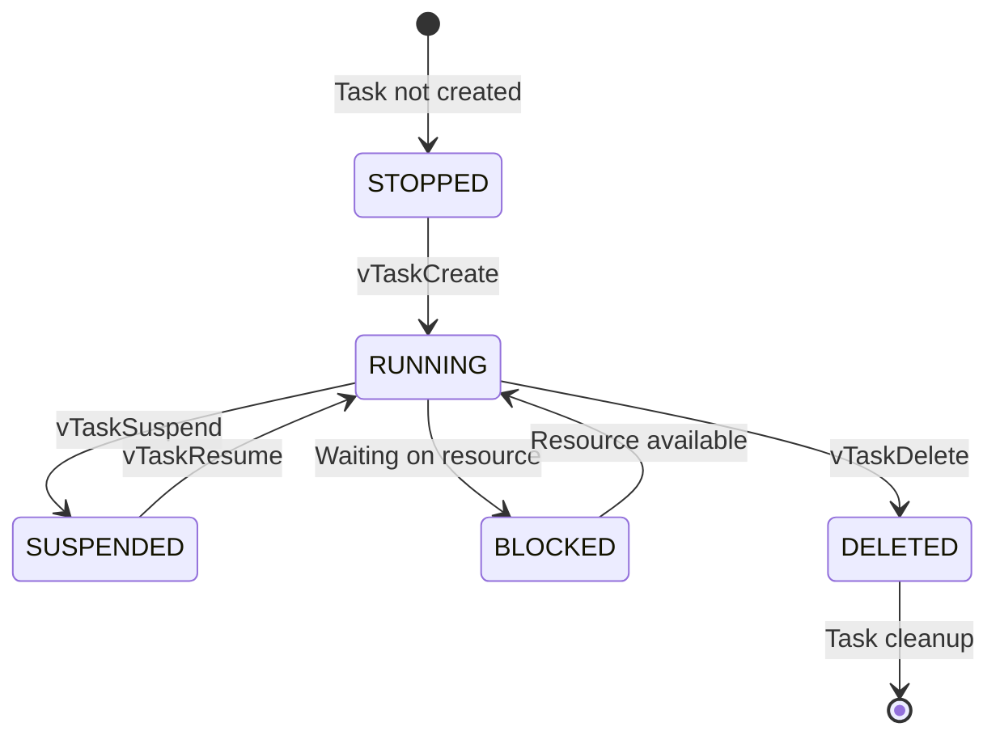
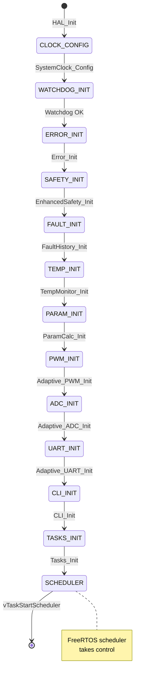
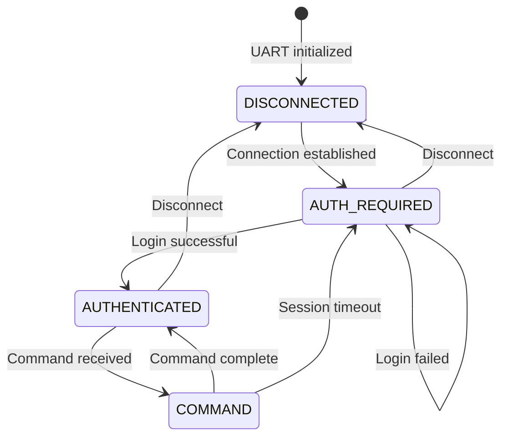
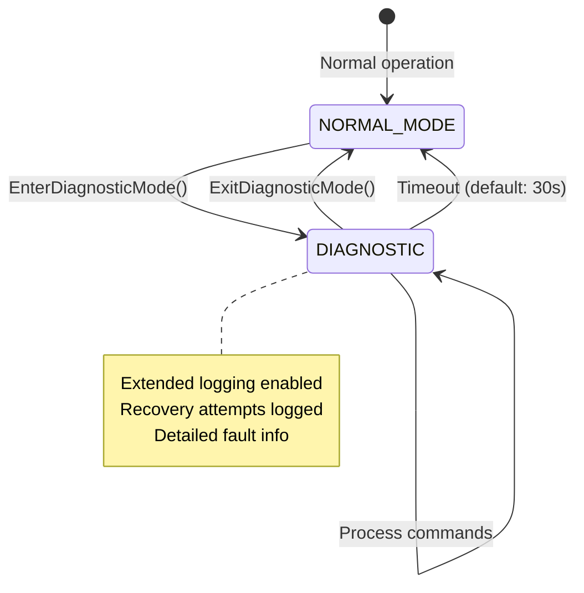

# State Machine Documentation

## Overview

This document describes the state machines in the AdaptivePWM system.

## Safety State Machine

The Enhanced Safety System manages the overall safety state of the system.

### State Descriptions

| State | Description | Entry Actions | Exit Conditions |
|-------|-------------|---------------|-----------------|
| `INIT` | System initialization | - Initialize modules - Load critical data | Init complete or failed |
| `NORMAL` | Full operation | - Clear degradations - Normal PWM limits | Fault detected or stop requested |
| `DEGRADED_PWM` | PWM in degraded mode | - Reduce duty cycle limit - Log degradation | Recovery success |
| `DEGRADED_ADC` | ADC in degraded mode | - Use estimated values - Reduce control frequency | Recovery success |
| `RECOVERY` | Attempting recovery | - Log recovery attempt - Execute recovery action | Success/failure |
| `SAFE_STOP` | Controlled shutdown | - Stop PWM - Safe GPIO state | Manual resume |
| `EMERGENCY` | Emergency stop | - Immediate PWM stop - Log emergency | Manual clear |
| `ERROR` | Fatal error state | - Log error - Safe shutdown | - |

## Recovery State Machine

### Recovery Actions

| Recovery Action | Description | Used For |
|-----------------|-------------|----------|
| `RETRY` | Simple delay and retry | Communication errors |
| `RESET` | Reset affected module | PWM/ADC faults |
| `DEGRADE` | Enter degraded mode | Non-critical faults |
| `STOP` | Safe stop | Serious faults |
| `RESTART` | System restart | Software faults |
| `MANUAL` | Requires operator | Hardware/config faults |
| `NONE` | No action | INFO level faults |

## Degradation Level State

### Degradation Effects

| Level | Duty Cycle Limit | Current Limit | Effect |
|-------|------------------|---------------|--------|
| `NONE` | 95% | 10A | Full operation |
| `LIGHT` | 85% (90% of max) | 9A | Slight reduction |
| `MODERATE` | 50% (configurable) | 7A | Significant reduction |
| `SEVERE` | 20% | 5A | Minimal operation |
| `CRITICAL` | 0% | 0A | No operation |

## Watchdog Module State

## Task State Machine

## System Initialization State

## UART CLI State Machine

## Diagnostic Mode State

